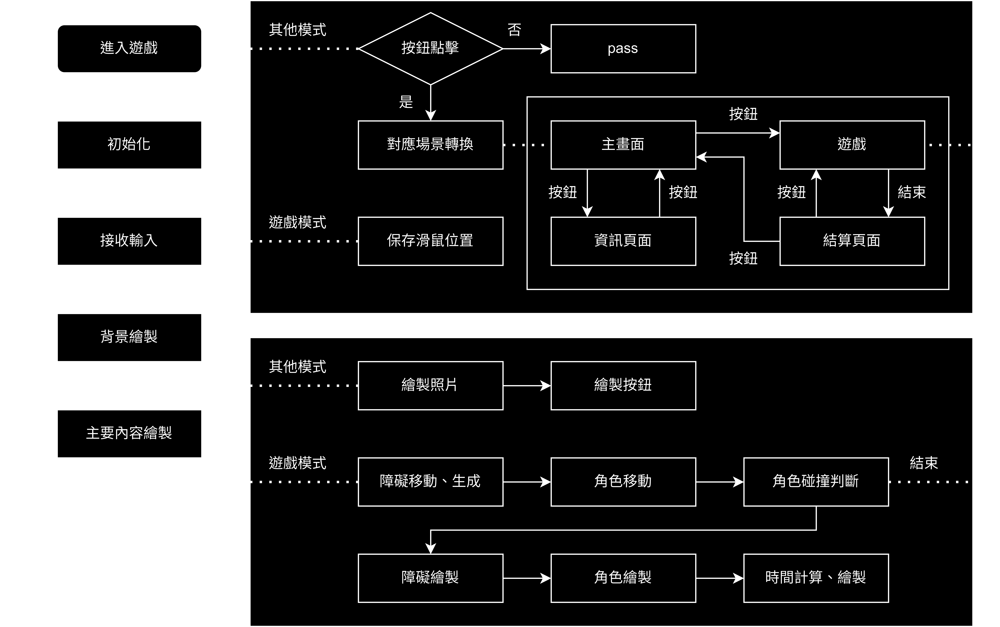

# Escape with scale | 2024 GMTK Game Jam

> Jam tomorrow and jam yesterday--but never jam today...
>
> Maybe we can join jam again ?

Game Jam Theme : Built to Scale

Game Jam Pages : [https://itch.io/jam/gmtk-2024](https://itch.io/jam/gmtk-2024)

My Game Pages : [https://itch.io/jam/gmtk-2024/rate/2903124](https://itch.io/jam/gmtk-2024/rate/2903124)

## What did I do ?

I made a game, the game is about a little cube trying to escape.

Player can move they mouse to change the cube’s scale,

and use different shapes to pass through the obstacle.

## Develop Info

- python 3.11
- pygame 2.5.0

flaw chat

## How to play?

You have three choose:

- Download by [itch.io](https://itch.io/jam/gmtk-2024/rate/2903124)
- Play by .exe. Download `EscpaceWithScale-2.0.zip`, unzip it, and run `_0main.exe`.
- Play by raw file. Clone this project, and run `main.py`
